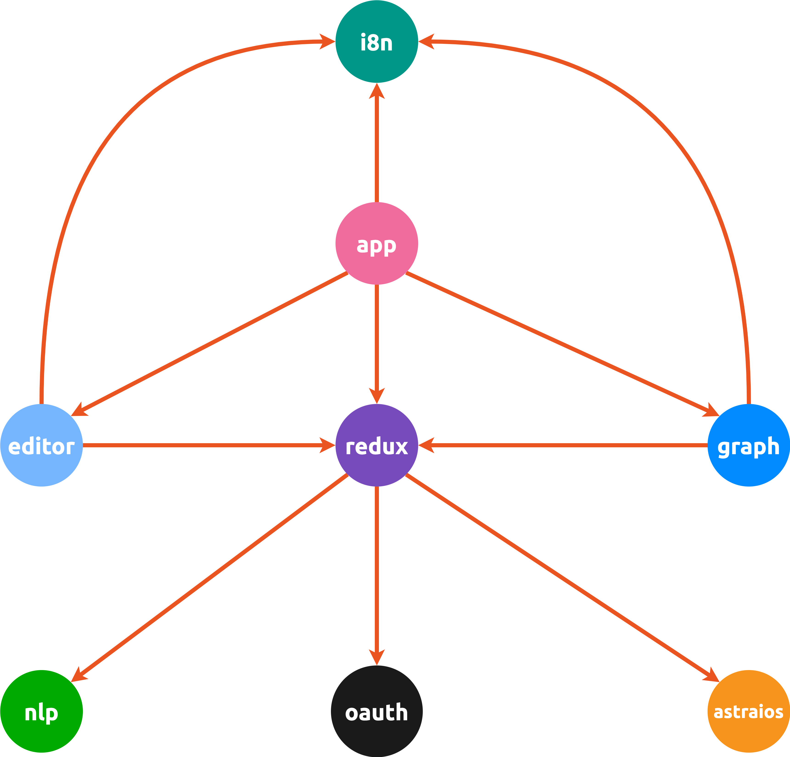

Dependency Diagram
------------------

:::info

"Source code dependencies must point only inward, toward higher-level policies."

Excerpt From _Clean Architecture: A Craftsman's Guide to Software Structure and Design_

Robert C. Martin

:::

Redux State
-----------

### Graph

- Graph JSON
- Graph ID
- User ID (logto)
