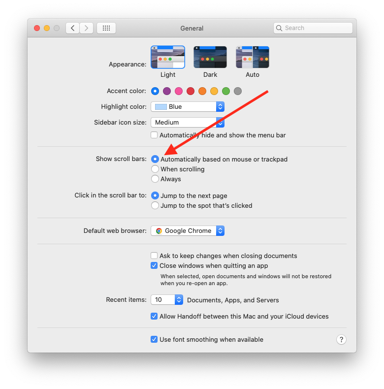

title: Troubleshooting
======================

This guide will guide you to solve the problem of partial function failure  
ps:The demonstration is on the macOS system, and other systems such as windows are similarly processed

Local Config Issues
-------------------

### Page scrollbars always exist

#### Problem Details

After entering the app page, the scroll bar does not disappear and the white border

#### Solution details

Open the **general settings** and find the **scroll bar settings**

Change the '**always**' option to '**Automatically based on mouse or trackpad**' or '**When scrolling**'

**or**

