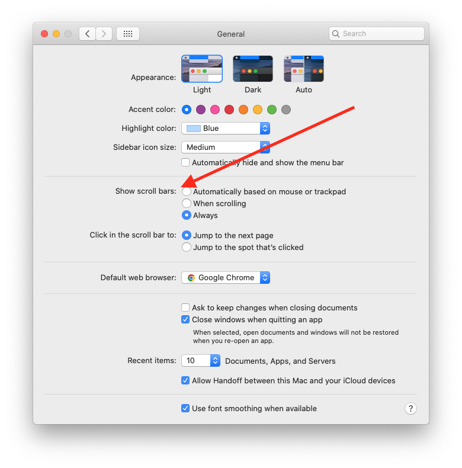
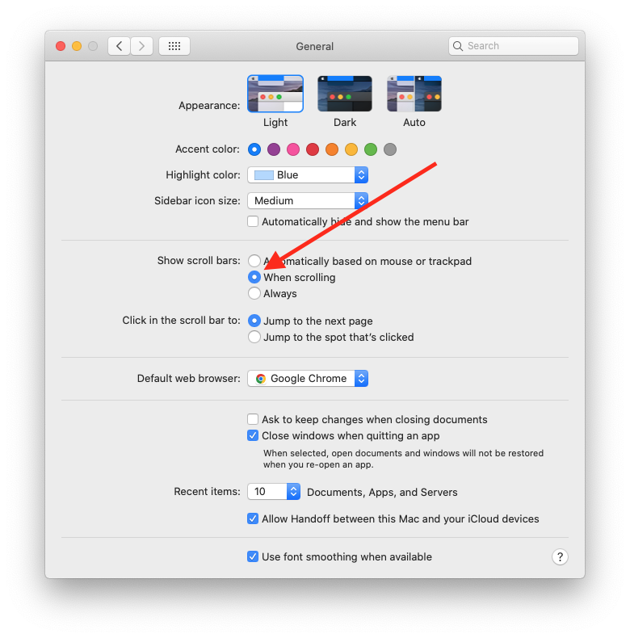

title: Troubleshooting
======================

This guide lists in detail the troubles that some users may encounter and attaches solutions

ps:The demonstration is on the macOS system, and other systems such as windows are similarly processed

Local Config Issues
-------------------

### Page scrollbars always exist

#### Problem Details

After entering the app page, the scroll bar does not disappear and the white border

#### Solution details

Open the **general settings** and find the **scroll bar settings**

Change the '**always**' option to '**Automatically based on mouse or trackpad**' or '**When scrolling**'

or

