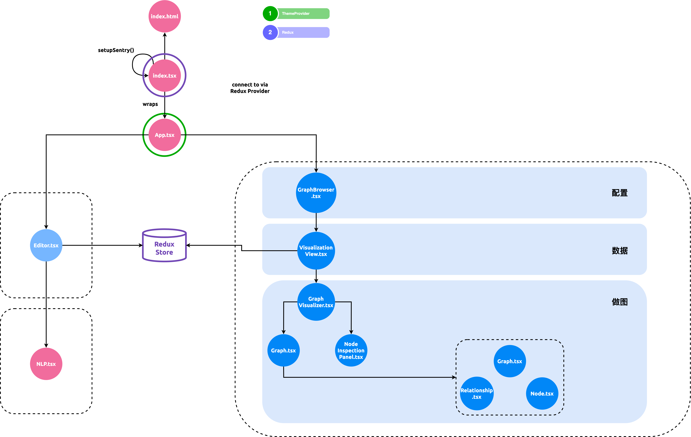

主要组件介绍
------------

Nexus Graph 的[UI 界面][UI 主界面]由两部分组成：

1. [文本编辑器](#编辑器)
2. [做图区域](#做图区域)

### 做图区域

#### GraphBrowser

**GraphBrowser** 是一个知识图谱可视化组件。Nexus Graph 的做图能力通过这个组件实现并连接至[主界面][UI 主界面]。

Nexus Graph 的设计遵循 [separation of concerns][separation of concerns] 原理 ；GraphBrowser 是唯一一个在其它 package
中可引入的做图组件，意味着，[nexus-graph] package 中的所有组件和代码都不能被 package 以外的组件引用，除了 GraphBrowser

#### VisualizationView

**VisualizationView** 是 Nexus Graph 做图组件的数据逻辑层，其作用是从 Redux Store 获取知识图谱的原始数据
（[Knowledge Graph Spec][Knowledge Graph Spec] 格式），转换成[做图组件的数据格式(`BasicNodesAndRels`)][Graph.tsx]，
最后传入[做图逻辑层](#做图逻辑层)

#### 做图逻辑层

介绍一下 Graph.tsx，建议提及一些将来不会变动的底层逻辑，比如“用到了 D3 实现做图”

#### Graph Model

- 介绍 Model 的三个主要组成：

  1. Graph.ts
  2. Node.ts
  3. Relationship.ts

- Straight/Arc/Loop arrow 的原理

#### 统计面板

- 统计面板中的数据是如何计算的

    - Graph.tsx 计算，通过 parent graphvisualizer 传入 NodeInspectorPanel
    - 最好有配图

### 编辑器

- 这里可以说简单些，提及是编辑器底层是用 [Lexical](https://lexical.dev/)

[UI 主界面]: https://github.com/paion-data/nexusgraph/blob/master/packages/nexusgraph-app/src/App.tsx

[Knowledge Graph Spec]: https://paion-data.github.io/knowledge-graph-spec/draft/#sec-Graph

[Graph.tsx]: https://github.com/paion-data/nexusgraph/blob/master/packages/nexusgraph-graph/src/Graph.tsx

[nexus-graph]: https://github.com/paion-data/nexusgraph/tree/master/packages/nexusgraph-graph

[separation of concerns]: https://en.wikipedia.org/wiki/Separation_of_concerns
