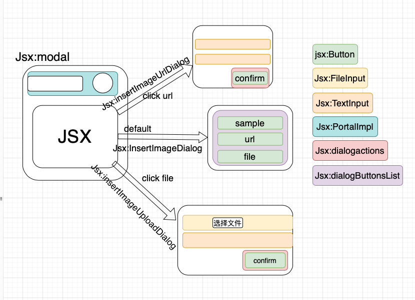

编辑器我们主要使用[lexical](https://playground.lexical.dev/)框架去实现，[由于lexical官方并没有把lexical-playground的所有模块发布到npm包](https://github.com/facebook/lexical/discussions/2406)，所以我们是通过复制粘贴lexical-playground基础代码（例如：编辑器多媒体组件中的插入图片功能插件），然后放进我们的项目中去完善编辑器功能。

## 多媒体

### 插入图片功能

图片插入控件代码:

packages/nexusgraph-editor/src/Lexical/plugins/ToolbarPlugin.tsx

```
 <DropDownItem
    onClick={() => {
        showModal("Insert Image", (onClose) => <InsertImageDialog editor={editor} onClose={onClose} />);
    }}
    className="item"
    >
    <i className="icon image" />
    <span className="text">Image</span>
</DropDownItem>
```

显示图片对话框代码:

packages/nexusgraph-editor/src/Lexical/plugins/ToolbarPlugin.tsx
```
const [modal, showModal] = useModal();
    <Toolbar>
       ...
      {modal}
    </Toolbar>
```

图片对话框组件图示



### 插入图片功能所需模块

 - ### useModal

packages/nexusgraph-editor/src/Lexical/plugins/Hooks/useModal.tsx

**自定义hook useModal 更新图片对话框**

 - ### Modal

**实现对话框的显示与关闭**

packages/nexusgraph-editor/src/Lexical/plugins/DropDown/Modal.tsx

 - ### ImageNode

**自定义节点ImageNode节点延伸DecoratorNode,使得可以在编辑器内插入图片组件**

packages/nexusgraph-editor/src/Lexical/plugins/nodes/ImageNode.tsx

 - ### ImagePlugin

**图片对话框中子选项组件**

packages/nexusgraph-editor/src/Lexical/plugins/DropDown/ImagePlugin.tsx

 - ### FileInput

**文件输入框组件**

packages/nexusgraph-editor/src/Lexical/plugins/DropDown/FileInput.tsx

 - ### TextInput

**文本输入框组件**

packages/nexusgraph-editor/src/Lexical/plugins/DropDown/TextInput.tsx

 - ### Dialog

**对话框子选项列表组件以及提交组件**

packages/nexusgraph-editor/src/Lexical/plugins/DropDown/Dialog.tsx

 - ### Button

**button控件组件**

packages/nexusgraph-editor/src/Lexical/plugins/DropDown/Button.tsx

 - ### canUseDom

**检查是否可以使用DOM，window, wiondow.document, window.doucument.creatElement同时存在时可以操作DOM**

**用来判断图片对话框是否渲染成功，以便于完成以后的Dom操作**

packages/nexusgraph-editor/src/Lexical/plugins/shared/canUseDom.ts

 - ### joinClasses

packages/nexusgraph-editor/src/Lexical/plugins/utils/joinClasses.ts

**根据boolean判断给Button加入不同类名**
